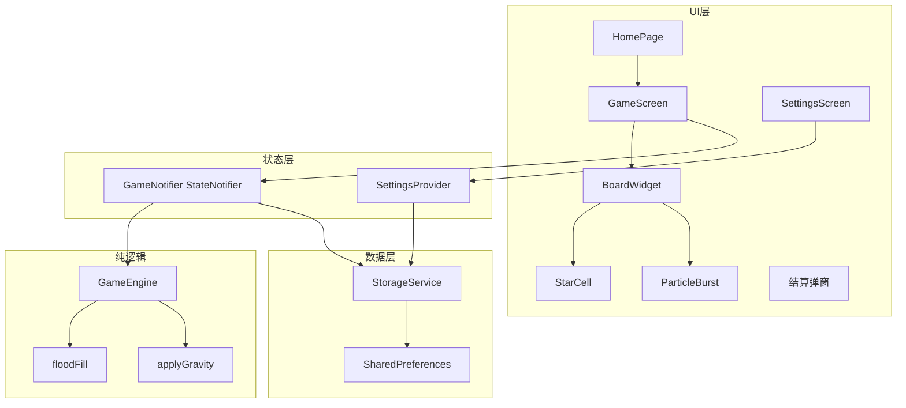
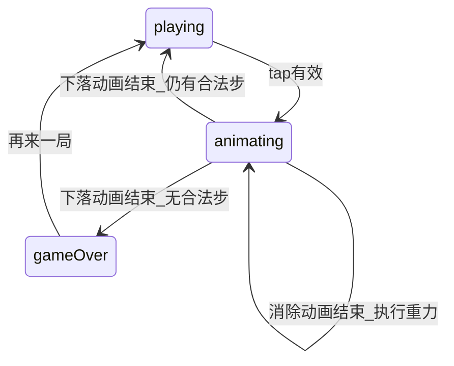

# 消灭星星 Flutter 完整实现计划

## 当前状态

项目已具备目录骨架与依赖（[`pubspec.yaml`](pubspec.yaml) 含 `flutter_riverpod`、`go_router`、`shared_preferences`、`flutter_animate`、`audioplayers`），但核心逻辑与 UI 均为 TODO：

| 模块 | 状态 |
|------|------|
| [`game_engine.dart`](lib/features/game/logic/game_engine.dart) | 空壳 |
| [`flood_fill.dart`](lib/features/game/logic/flood_fill.dart) / [`gravity.dart`](lib/features/game/logic/gravity.dart) | 空壳 |
| [`board_widget.dart`](lib/features/game/widgets/board_widget.dart) / [`star_cell.dart`](lib/features/game/widgets/star_cell.dart) | Placeholder |
| [`game_screen.dart`](lib/features/game/game_screen.dart) | 仅占位文本 |
| [`storage_service.dart`](lib/services/storage_service.dart) | 仅有中途存档，缺最高分/设置 |
| [`main.dart`](lib/main.dart) | 无 `ProviderScope`；首页跳转 `/game/continue` 路由未注册 |
| 单元测试 | 仅默认 [`widget_test.dart`](test/widget_test.dart)（引用不存在的 `MyApp`，已失效） |

---

## 编码规范（响应你的两点要求）

**1. 每文件顶部模块注释**

每个 `.dart` 文件首行起用 `///` 块注释说明：该文件职责、对外暴露的类型、与上下游的依赖关系。示例：

```dart
/// 游戏核心引擎：负责棋盘初始化、点击消除、重力、计分与死局检测。
/// 纯 Dart 类，不依赖 Flutter Widget，便于单元测试。
```

**2. 尽可能少用语法糖**

| 避免 | 改用 |
|------|------|
| Record 类型 `({int row, int col})` | 显式 `GridPosition` 类 |
| 链式 `.map().where().toList()` | `for` 循环 + 临时 `List` |
| Cascade `..` | 分步赋值 |
| `flutter_animate` 扩展 DSL | `AnimationController` + `Tween` + `AnimatedBuilder` |
| `?.` / `??` 长链 | 显式 `if (x != null)` 分支 |
| 箭头函数写多行逻辑 | 具名方法 + 花括号函数体 |
| `freezed` / `riverpod_generator` | 手写 `copyWith` + `StateNotifier` |

保留必要的 Flutter 惯用法（`const` 构造、`StatelessWidget`/`StatefulWidget`），不刻意回避。

---

## 架构与数据流



---

## 实现步骤

### 阶段 1：数据模型与常量补全

**新增/修改文件：**

- [`lib/features/game/models/grid_position.dart`](lib/features/game/models/grid_position.dart) — 行列坐标类（替代 record）
- [`lib/features/game/models/eliminate_result.dart`](lib/features/game/models/eliminate_result.dart) — 一次消除的返回值：被消除坐标列表、得分增量
- [`lib/features/game/models/game_state.dart`](lib/features/game/models/game_state.dart) — 增加 `copyWith` 方法（手写，不用 freezed）
- [`lib/core/constants/game_constants.dart`](lib/core/constants/game_constants.dart) — 补充计分公式 `scoreForCount(n) => n * (n - 1) * 5`、颜色映射表
- [`lib/features/game/models/star_color.dart`](lib/features/game/models/star_color.dart) — 增加 `toColor()` 返回 `Color`（显式 switch，不用 map 查找）

**棋盘表示约定：** `Cell.color == null` 表示空格；`GameState.board` 保持 `List<List<Cell>>` 固定尺寸，与 [`storage_service.dart`](lib/services/storage_service.dart) 现有编解码兼容。

---

### 阶段 2：核心算法（纯 Dart + 单元测试）

**[`flood_fill.dart`](lib/features/game/logic/flood_fill.dart)**

- BFS 四方向扩展，返回 `List<GridPosition>`
- 边界检查、同色判断、已访问集合用 `Set<String>`（`"$row,$col"` 键，避免 record Set 问题）

**[`gravity.dart`](lib/features/game/logic/gravity.dart)**

- 逐列自下而上扫描，非空格下移填补 `null`
- 同步更新 `Cell.row`（列索引不变，行索引重算）

**[`game_engine.dart`](lib/features/game/logic/game_engine.dart)** 完整接口：

```dart
void newGame({int rows, int cols, int colorCount});
EliminateResult? tap(int row, int col);  // null = 无效点击（连通数 < 2）
void applyGravity();
bool hasValidMove();
int calcScore(int count);
```

- `newGame`：随机填充 + 死局预检循环重试（最多 N 次）
- `tap`：flood fill → 标记消除（color 置 null）→ 计分 → 返回 `EliminateResult`
- `hasValidMove`：遍历每个非空格做 flood fill，存在 `>= 2` 即返回 true

**新增 [`test/game_engine_test.dart`](test/game_engine_test.dart)**（8~10 用例）：

- 2 相邻同色可消除 / 1 个孤立不可消除
- 消除后重力正确
- 计分公式
- 死局检测
- 随机棋盘开局有合法步

**修复 [`test/widget_test.dart`](test/widget_test.dart)**：改为验证首页标题「消灭星星」渲染。

---

### 阶段 3：状态管理与路由

**[`lib/features/game/providers/game_notifier.dart`](lib/features/game/providers/game_notifier.dart)**（新建，替代仅暴露 `GameEngine` 的 [`game_provider.dart`](lib/features/game/providers/game_provider.dart)）

- `StateNotifier<GameState>` 封装：
  - `startNewGame()` / `loadSavedGame(GameState)`
  - `onCellTap(row, col)` — 驱动动画状态机
  - `finishEliminateAnimation()` → 调用 `applyGravity` → 进入下落阶段
  - `finishGravityAnimation()` → 死局检测 → `gameOver` 或回到 `playing`
  - 每次状态变更后调用 `StorageService.saveGame`（playing 时自动存档）

**[`lib/main.dart`](lib/main.dart)** 修改：

- 根节点包裹 `ProviderScope`
- 路由补全：
  - `/game` — 新游戏（进入时 `startNewGame`）
  - `/game/continue` — 继续游戏（`loadSavedGame`）
  - `/settings` — 设置页
- 结算改为 **游戏内弹窗**（`showDialog`），移除硬编码 `score: 0` 的独立 `/game/result` 路由（或保留路由但由 `extra` 传分）

**删除无用桩文件：** [`lib/core/game_core.dart`](lib/core/game_core.dart)（空类，与 `GameEngine` 重复）

---

### 阶段 4：UI 实现

**[`star_cell.dart`](lib/features/game/widgets/star_cell.dart)**

- 圆角色块 + 轻微高光；`color == null` 时渲染透明占位
- 支持 `isHighlighted`（连通预览）、`scale`（消除动画驱动）
- `GestureDetector.onTap` 回调

**[`board_widget.dart`](lib/features/game/widgets/board_widget.dart)**

- `LayoutBuilder` 计算 `cellSize = min(width/cols, height/rows)`
- `GridView` 或手写 `Stack` + `Positioned`（下落动画用后者更直观）
- `RepaintBoundary` 包裹棋盘
- 点击时若 `status == playing`，通知 `GameNotifier`

**[`game_screen.dart`](lib/features/game/game_screen.dart)**

- 顶部：当前分数
- 中部：`BoardWidget`
- 底部：重玩 / 返回首页
- `status == animating` 时忽略输入
- `gameOver` 时弹出结算 Dialog（本局得分、最高分、破纪录提示、再来一局/回首页）

**[`home_screen.dart`](lib/features/home/home_screen.dart)** 补全：

- 展示最高分（`FutureBuilder` 读 `StorageService.getHighScore()`）
- 增加「设置」按钮跳转 `/settings`
- 修复 `/game/continue` 路由对齐

**新建 [`lib/features/settings/settings_screen.dart`](lib/features/settings/settings_screen.dart)**

- 音效开关、震动开关（`SwitchListTile`）
- 读写 `StorageService`

**[`app_theme.dart`](lib/core/theme/app_theme.dart)** — 深蓝/深紫渐变背景色、`StarColor.toColor()` 配色统一

---

### 阶段 5：动画与粒子特效

动画状态机（在 `GameNotifier` 中）：



**消除动画：** `AnimationController`（~250ms）驱动 `StarCell` scale 1.0→0 + opacity 1.0→0

**下落动画：** 记录每格 `fromRow → toRow`，`AnimationController`（~300ms）插值 `top` 偏移

**[`particle_burst.dart`](lib/features/game/widgets/particle_burst.dart)**

- `StatefulWidget` + `CustomPainter`
- 消除时在该格中心生成 12~16 个粒子，`Ticker` 驱动 400ms 生命周期
- 独立 `Overlay` 层，避免 rebuild 整个棋盘

**音效（可选，受设置开关控制）：**

- 在 `assets/audio/` 放占位 mp3（或先用系统无音效、代码留好 `AudioPlayer` 调用点）
- `pubspec.yaml` 声明 assets

---

### 阶段 6：本地存档扩展

扩展 [`storage_service.dart`](lib/services/storage_service.dart)：

| Key | 类型 | 用途 |
|-----|------|------|
| `saved_game` | JSON | 已有，中途存档 |
| `high_score` | int | 历史最高分 |
| `sound_enabled` | bool | 音效开关，默认 true |
| `vibration_enabled` | bool | 震动开关，默认 true |

新增方法：`getHighScore` / `setHighScore`、`getSoundEnabled` / `setSoundEnabled` 等；`gameOver` 时比较并更新最高分。

---

### 阶段 7：更新开发计划文档

更新 [`docs/开发计划.md`](docs/开发计划.md)：

1. **Frontmatter todos** — 将 `env-setup`、`game-engine`、`ui-board`、`animations`、`storage-settings` 标为 `completed`；`test-optimize` 标为 `in_progress`；发布相关保持 `pending`
2. **新增「十二、实现记录」章节** — 记录：
   - 实际完成的文件清单
   - 编码规范（模块注释 + 少语法糖）说明
   - 与计划差异（如结算用 Dialog 而非独立页面、删除 `game_core.dart`）
   - 本地运行与测试命令
3. **修正第十章执行清单** — 勾选已完成项

---

## 关键文件关系（实现后）

```
lib/
├── main.dart                          # ProviderScope + 路由
├── core/
│   ├── constants/game_constants.dart  # 尺寸、计分
│   └── theme/app_theme.dart
├── features/
│   ├── home/home_screen.dart
│   ├── settings/settings_screen.dart  # 新建
│   └── game/
│       ├── game_screen.dart
│       ├── models/                    # + grid_position, eliminate_result
│       ├── logic/                     # 完整实现
│       ├── providers/game_notifier.dart
│       └── widgets/                   # 完整实现
├── services/storage_service.dart      # 扩展最高分/设置
test/
├── game_engine_test.dart              # 新建
└── widget_test.dart                   # 修复
```

---

## 验证清单

实现完成后执行：

```powershell
flutter pub get
flutter analyze
flutter test
flutter run -d windows   # 或 Android 模拟器
```

手动验证：新游戏 → 点击消除 → 重力下落 → 死局结算 → 最高分持久化 → 继续游戏 → 设置开关生效 → 动画期间快速连点不崩溃。
