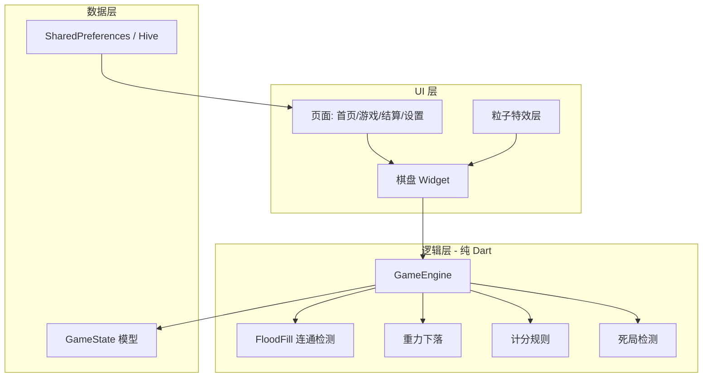
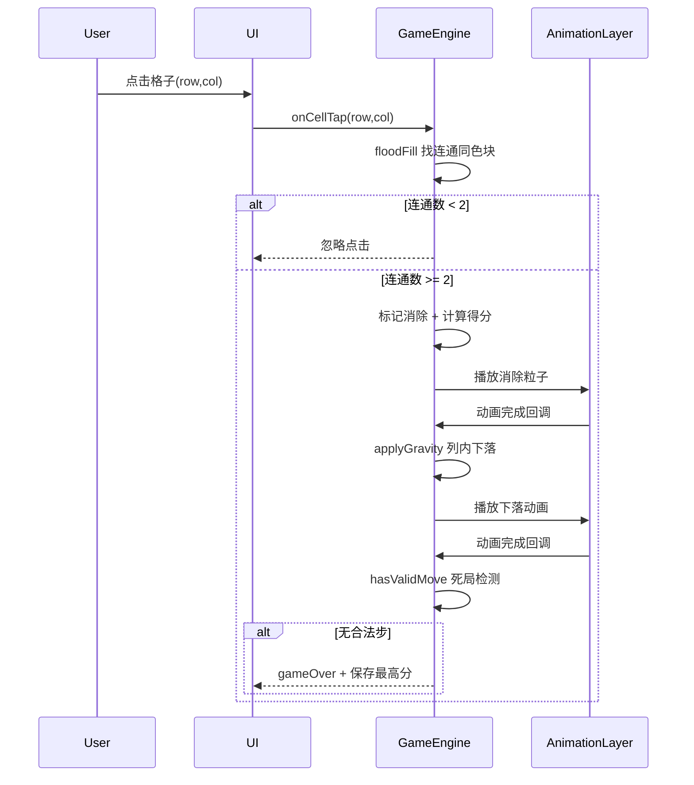

# 消灭星星 Flutter 完整开发计划

## 一、项目概述与目标

| 项 | 说明 |
|---|---|
| 游戏名 | 消灭星星 |
| 平台 | Android + iOS |
| 核心玩法 | 点击相邻（上下左右）同色块消除，至少 2 个；消除后上方块下落；不补充新块；无可消除时游戏结束 |
| 扩展功能 | 本地最高分/设置存档；消除爆炸动画与粒子特效 |
| 当前环境 | Flutter 3.16.8（建议升级至 3.24+ stable）、Android 工具链已就绪；**iOS 打包必须在 macOS + Xcode 上完成** |

---

## 二、技术选型

### 推荐方案：Flutter 原生 UI + 轻量动画库（不引入完整游戏引擎）

经典消灭星星是**网格逻辑 + 2D UI 动画**，不需要 Flame/Unity 级别的引擎。



| 类别 | 推荐 | 理由 |
|---|---|---|
| 框架 | **Flutter 3.24+ stable** | 你当前 3.16.8 可用但偏旧，升级后 Android/iOS 构建更稳 |
| 状态管理 | **Riverpod 2.x** | 游戏状态、设置、存档分离清晰，测试友好 |
| 路由 | **go_router** | 声明式页面跳转（首页 → 游戏 → 结算） |
| 本地存储 | **shared_preferences**（设置+最高分） | 数据量小，零配置；若以后要关卡存档再换 Hive |
| 动画 | **Flutter AnimationController** + **flutter_animate** | 下落、缩放、淡出 |
| 粒子特效 | **自定义 CustomPainter 粒子** 或 **confetti** | 消除时短促爆发，性能可控 |
| 音效（可选） | **audioplayers** | 点击/消除/游戏结束音效 |
| 测试 | **flutter_test** + **mockito** | 核心算法单元测试 |

**不选 Flame 的原因**：棋盘是离散格子逻辑，Flame 的 Component/World 模型会增加复杂度；粒子可用 Overlay 层单独实现。

---

## 三、前期环境准备

### 3.1 升级 Flutter（建议）

```powershell
flutter upgrade
flutter --version        # 目标 >= 3.24
dart --version           # 目标 >= 3.5
```

### 3.2 验证开发环境

```powershell
flutter doctor -v
```

你当前状态：
- Android：已就绪（SDK 36、许可证已接受）
- Windows 桌面 / Chrome：可用于快速调试 UI
- iOS：**Windows 无法本地编译 iOS**，需后续在 Mac 上 `flutter build ios` 或使用 CI（Codemagic / GitHub Actions macOS runner）

### 3.3 IDE 与插件

- **Cursor / VS Code**：已安装 Flutter 扩展 3.136.0
- 推荐额外插件：`Dart`、`Flutter Widget Snippets`
- **Android Studio**：用于 Android 模拟器管理、APK 签名调试

### 3.4 创建项目

```powershell
flutter create pop_star --org com.yourname.popstar --platforms android,ios
cd pop_star
```

建议目录结构：

```
lib/
├── main.dart
├── app.dart                    # MaterialApp + 路由
├── core/
│   ├── constants/              # 颜色数、棋盘尺寸、计分表
│   └── theme/                  # 主题色
├── features/
│   ├── game/
│   │   ├── models/             # Cell, Board, GameStatus
│   │   ├── logic/              # GameEngine, flood_fill, gravity
│   │   ├── providers/          # Riverpod providers
│   │   └── widgets/            # Board, StarCell, ParticleBurst
│   ├── home/                   # 开始页
│   ├── result/                 # 结算页
│   └── settings/               # 音效/震动开关
└── services/
    └── storage_service.dart    # 本地存档
```

### 3.5 添加依赖（`pubspec.yaml`）

```yaml
dependencies:
  flutter_riverpod: ^2.5.1
  go_router: ^14.2.0
  shared_preferences: ^2.3.2
  flutter_animate: ^4.5.0
  audioplayers: ^6.1.0   # 可选

dev_dependencies:
  flutter_test:
    sdk: flutter
  mockito: ^5.4.4
  build_runner: ^2.4.11
```

```powershell
flutter pub get
```

### 3.6 调试环境初始化

| 场景 | 命令 | 用途 |
|---|---|---|
| Windows 桌面快速迭代 | `flutter run -d windows` | UI/逻辑最快反馈 |
| Android 模拟器 | 先在 Android Studio 创建 AVD，再 `flutter run -d <device_id>` | 触控、性能接近真机 |
| Android 真机 | 开启 USB 调试，`flutter devices` 确认后 `flutter run` | 帧率与手势真实体验 |
| 热重载 | 运行中按 `r`（重载）/ `R`（重启） | UI 快速调试 |
| DevTools | 运行后终端链接，或 `flutter pub global run devtools` | 性能、内存、Widget 树 |

**调试技巧**：
- 游戏逻辑写在**纯 Dart 类**（不依赖 Widget），可用单元测试直接验证
- 用 `debugPrint` 或 `logger` 输出棋盘状态辅助排查死局逻辑
- 动画阶段用 `AnimationController` + `TickerMode` 避免后台耗电

---

## 四、核心游戏设计

### 4.1 数据模型

```dart
enum StarColor { red, green, blue, yellow, purple, orange }
enum GameStatus { playing, animating, gameOver }

class Cell {
  final int row, col;
  StarColor? color;  // null 表示空格
}

class GameState {
  List<List<Cell>> board;   // 默认 10x10
  int score;
  GameStatus status;
}
```

### 4.2 初始化棋盘

- 默认 **10×10**，**5~6 种颜色**
- 生成时做**死局预检**：若开局无可消除组合，重新随机（经典做法）
- 可选：保证至少存在一组可消除（提升体验）

### 4.3 核心算法（按顺序执行）



**1. 连通块检测（Flood Fill / BFS）**

- 从点击格出发，四方向扩展同色相邻格
- 返回 `List<Point>`；`length < 2` 则不消除

**2. 计分规则（经典公式）**

- 消除 n 个块得分：`score += n * (n - 1) * 5`（可配置常量表）
- 全部清空额外奖励（可选）

**3. 重力下落**

- 对每一列自下而上扫描：非空格下移填补 null
- 不产生新方块（经典模式）

**4. 死局检测**

- 遍历每个非空格，BFS 检测是否存在 `>= 2` 的连通块
- 若无 → `GameStatus.gameOver`

### 4.4 动画设计

| 阶段 | 效果 | 实现 |
|---|---|---|
| 选中预览 | 连通块轻微放大/高亮边框 | `AnimatedScale` + 边框 |
| 消除 | 缩放至 0 + 淡出 | `flutter_animate` 或 `AnimationController` |
| 粒子爆发 | 10~20 个小星形粒子向外飞散 | `CustomPainter` + `Ticker`，生命周期 300~500ms |
| 下落 | 格子位移动画 | `AnimatedPositioned` 或补间动画映射 row→offset |
| 游戏结束 | 棋盘置灰 + 弹窗 | `Modal` + 分数展示 |

**性能要点**：
- 粒子用独立 `Overlay`，不 rebuild 整个棋盘
- 动画期间锁定输入（`status == animating`）
- 棋盘用 `RepaintBoundary` 包裹减少重绘

### 4.5 本地存档（SharedPreferences）

| Key | 类型 | 说明 |
|---|---|---|
| `high_score` | int | 历史最高分 |
| `sound_enabled` | bool | 音效开关 |
| `vibration_enabled` | bool | 震动开关（`vibration` 包，可选） |

封装 `StorageService`，在 `gameOver` 时比较并更新最高分。

---

## 五、UI/页面规划

### 5.1 页面列表

1. **首页（Home）**：游戏标题、开始按钮、设置入口、最高分展示
2. **游戏页（Game）**：顶部分数、棋盘、底部重玩/提示（提示可选）
3. **结算弹窗（Result）**：本局得分、是否破纪录、再来一局/返回首页
4. **设置页（Settings）**：音效、震动开关

### 5.2 视觉建议

- 背景：深蓝/深紫渐变
- 星块：圆角方块 + 星星图标或纯色块 + 高光
- 字体：`google_fonts` 可选，标题用圆润风格
- 支持竖屏锁定：`SystemChrome.setPreferredOrientations`

### 5.3 资源准备

```
assets/
├── images/       # 星块皮肤（若不用纯色）
├── audio/
│   ├── pop.mp3
│   └── game_over.mp3
└── fonts/        # 可选
```

`pubspec.yaml` 中声明 `assets` 并在 `flutter pub get` 后使用。

---

## 六、开发阶段与里程碑

### 阶段 1：基础框架（1~2 天）

- 创建项目、配置依赖、路由骨架
- 实现 `GameEngine` 纯逻辑（无 UI）：初始化、Flood Fill、重力、计分、死局
- **单元测试覆盖核心算法**（至少 8~10 个用例）

### 阶段 2：棋盘 UI（2~3 天）

- `BoardWidget` 渲染 10×10 格子
- 点击交互接入 `GameEngine`
- 分数栏、重玩按钮

### 阶段 3：动画与特效（2~3 天）

- 消除/下落动画串联（状态机：`playing → animating → playing/gameOver`）
- 粒子爆发组件
- 音效接入（受设置开关控制）

### 阶段 4：存档与打磨（1~2 天）

- 最高分持久化
- 设置页
- 首页/结算页完整流程
- 无障碍：Semantics 标签

### 阶段 5：测试与优化（1~2 天）

- 多分辨率适配（`LayoutBuilder` 计算 cellSize）
- 真机性能 profiling（目标 60fps）
- 修复边界：快速连点、动画中途退出

**预估总工期：7~12 天**（单人业余开发）

---

## 七、测试策略

### 7.1 单元测试（必做）

文件：`test/game_engine_test.dart`

- 2 个相邻同色 → 可消除
- 1 个孤立块 → 不可消除
- 消除后重力正确
- 计分公式正确
- 死局检测正确
- 随机棋盘无初始死局

```powershell
flutter test
```

### 7.2 Widget 测试

- 棋盘渲染格子数量
- 点击后分数变化

### 7.3 手动测试清单

- [ ] Android 模拟器 + 真机各跑一遍完整流程
- [ ] 快速连续点击不崩溃
- [ ] 旋转屏幕（若锁定竖屏则确认无效）
- [ ] 杀进程重启后最高分保留
- [ ] 低端机（2GB RAM）帧率可接受

---

## 八、打包与发布

### 8.1 通用发布前检查

```powershell
flutter clean
flutter pub get
flutter test
flutter analyze
flutter build apk --release   # 先验证 Android
```

修改应用信息：
- `android/app/src/main/AndroidManifest.xml`：`android:label="消灭星星"`
- `ios/Runner/Info.plist`：`CFBundleDisplayName`
- 替换默认图标：使用 `flutter_launcher_icons` 包一键生成

```yaml
# pubspec.yaml dev_dependencies
flutter_launcher_icons: ^0.14.1

flutter_launcher_icons:
  android: true
  ios: true
  image_path: "assets/icon/app_icon.png"
```

### 8.2 Android 发布

**调试包（内测分发）**

```powershell
flutter build apk --debug
# 输出: build/app/outputs/flutter-apk/app-debug.apk
```

**正式 Release APK（侧载/国内渠道）**

1. 创建签名密钥（仅首次）：

```powershell
keytool -genkey -v -keystore popstar-release.jks -keyalg RSA -keysize 2048 -validity 10000 -alias popstar
```

2. 配置 `android/key.properties`（**不要提交到 Git**）：

```properties
storePassword=***
keyPassword=***
keyAlias=popstar
storeFile=../popstar-release.jks
```

3. 修改 `android/app/build.gradle` 引用签名配置

4. 构建：

```powershell
flutter build apk --release          # 通用 APK
flutter build appbundle --release    # Google Play 推荐 AAB
```

**Google Play 上架要点**
- 注册 Google Play Console（一次性 $25）
- 上传 AAB，填写商店截图、隐私政策
- 目标 API Level 需满足 Google 最新要求（你 SDK 36 已满足）
- 填写内容分级问卷

### 8.3 iOS 发布（需 macOS）

> Windows 无法完成 iOS 编译。可选方案：
> - 借用 Mac 本地构建
> - 使用 **Codemagic** / **GitHub Actions (macos-latest)** 云构建

**Mac 上步骤概要**：

1. 安装 Xcode + CocoaPods
2. `cd ios && pod install`
3. 用 Xcode 打开 `ios/Runner.xcworkspace`
4. 配置 **Signing & Capabilities**（Apple Developer 账号，$99/年）
5. 设置 Bundle ID：`com.yourname.popstar`
6. 构建：

```bash
flutter build ios --release
```

7. Xcode → **Product → Archive** → 上传 **App Store Connect**
8. 在 App Store Connect 填写元数据、截图（6.7"/6.1"/5.5" 等），提交审核

**iOS 审核注意**
- 若无账号/内购/收集数据，隐私声明可极简
- 游戏需有完整可玩流程，不能是占位 Demo
- 若加广告，需声明 ATT（追踪透明度）

### 8.4 版本号管理

`pubspec.yaml`：

```yaml
version: 1.0.0+1   # 1.0.0=版本名, 1=构建号（每次上架递增）
```

---

## 九、风险与注意事项

| 风险 | 应对 |
|---|---|
| Flutter 版本过旧 | 升级到最新 stable，避免新 Android Gradle 插件不兼容 |
| iOS 无 Mac | 提前规划云构建或借用 Mac；Android 可先在 Windows 完成 |
| 动画卡顿 | 减少 rebuild 范围；粒子数量上限；用 DevTools Performance 分析 |
| 网络安全检查失败 | 你 `flutter doctor` 有 maven 超时，发布前确保网络/VPN 正常或配置国内镜像 |
| 国内 Android 上架 | Google Play 以外还需适配各厂商商店（华为/小米/OPPO 等），签名与隐私合规各不同 |

---

## 十、推荐开发顺序（执行清单）

- [x] 1. `flutter create` + 依赖 + 目录结构
- [x] 2. 实现并测试 `GameEngine`（纯 Dart）
- [x] 3. 搭建 Riverpod + 路由 + 首页
- [x] 4. 实现棋盘 UI + 点击消除（无动画）
- [x] 5. 加入消除/下落动画状态机
- [x] 6. 粒子特效（音效开关已预留，音频资源待补充）
- [x] 7. 本地存档 + 设置 + 结算弹窗
- [ ] 8. 图标/启动图/应用名
- [x] 9. `flutter test` + `flutter analyze` 全通过（真机测试待做）
- [ ] 10. Android Release 打包 → 内测 → 上架
- [ ] 11. Mac 环境 iOS 打包 → TestFlight → App Store

---

## 十一、关键代码骨架参考

**GameEngine 对外接口（建议）**：

```dart
class GameEngine {
  GameState get state;

  void newGame({int rows = 10, int cols = 10, int colorCount = 5});
  EliminateResult? tap(int row, int col);  // null = 无效点击
  void applyGravity();
  bool hasValidMove();
  int calcScore(int eliminatedCount);
}
```

**动画状态机**：

```dart
// playing 时接受输入
// tap 后 → animating → 消除动画 → 下落动画 → playing 或 gameOver
```

此接口设计使 UI 层只负责「展示状态 + 触发动作 + 播放动画」，逻辑可独立测试，是本项目可维护性的关键。

---

## 十二、实现记录（2026-07-02）

### 12.1 已完成功能

| 模块 | 文件 | 说明 |
|------|------|------|
| 核心算法 | `lib/features/game/logic/game_engine.dart` | 初始化、点击消除、重力、计分、死局检测 |
| 连通检测 | `lib/features/game/logic/flood_fill.dart` | BFS 四方向 Flood Fill |
| 重力下落 | `lib/features/game/logic/gravity.dart` | 列内下落 + 位移动画映射 |
| 状态管理 | `lib/features/game/providers/game_notifier.dart` | StateNotifier 动画状态机 |
| 棋盘 UI | `lib/features/game/widgets/board_widget.dart` | 10×10 自适应、消除/下落动画 |
| 星块渲染 | `lib/features/game/widgets/star_cell.dart` | 圆角色块 + 高亮 |
| 粒子特效 | `lib/features/game/widgets/particle_burst.dart` | CustomPainter 爆发 |
| 游戏页 | `lib/features/game/game_screen.dart` | 分数栏、结算弹窗 |
| 首页 | `lib/features/home/home_screen.dart` | 开始/继续/设置、最高分 |
| 设置页 | `lib/features/settings/settings_screen.dart` | 音效/震动开关 |
| 本地存储 | `lib/services/storage_service.dart` | 中途存档、最高分、设置 |
| 单元测试 | `test/game_engine_test.dart` | 10 个用例覆盖核心算法 |

### 12.2 编码规范落实

- **模块注释**：每个 `.dart` 文件顶部均有 `///` 功能描述。
- **少用语法糖**：使用 `GridPosition` 类替代 Record；`for` 循环替代链式集合操作；`AnimationController` 替代 `flutter_animate` DSL；手写 `copyWith` 替代 freezed。

### 12.3 与计划的差异

| 项 | 计划 | 实际 |
|----|------|------|
| 结算页 | 独立 Result 页面 | 游戏内 `AlertDialog` 弹窗 |
| 音效 | audioplayers 接入 | 设置开关已就绪，音频资源待补充 |
| game_core.dart | 无 | 已删除空桩文件 |
| 路由 | `/game/result` | 已移除，改用弹窗 |

### 12.4 本地运行与验证

```powershell
cd c:\Z\pop_star
flutter pub get
flutter analyze    # 无告警
flutter test       # 11 个测试全通过
flutter run -d windows   # 或连接 Android 模拟器/真机
```

### 12.5 待办（下一阶段）

- [ ] 补充 `assets/audio/` 音效文件并接入 `audioplayers`
- [ ] 真机多分辨率与性能 profiling
- [ ] 应用图标、启动图、应用名称配置
- [ ] Android/iOS Release 打包与上架
